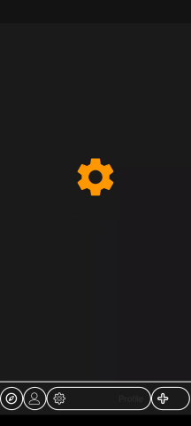
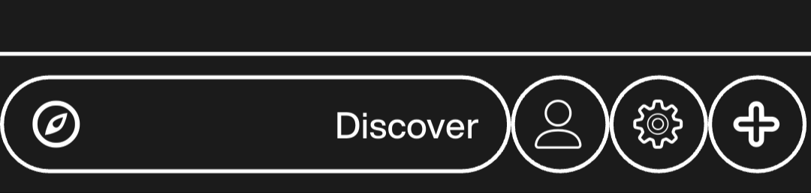

# Custom Bottom Navigation Bar

A Flutter project demonstrating a custom bottom navigation bar UI component.

## 🔧 Overview

This project showcases how to implement a **custom bottom navigation bar** using Flutter, with animated transitions and customizable design — useful for apps like SpotIt or any Flutter application needing a unique nav bar.

## 🎯 Features

- Fully customizable bottom navigation bar
- Animated icon and text transitions
- Dark-themed UI (compatible with modern designs)
- Easily extendable with custom widgets and logic
## 🖼 Preview

### Static Screenshot

## 🛠 Getting Started

### Prerequisites

- Flutter SDK installed ([Install Flutter](https://docs.flutter.dev/get-started/install))
- Android Studio / VS Code
- Emulator or physical device for testing

